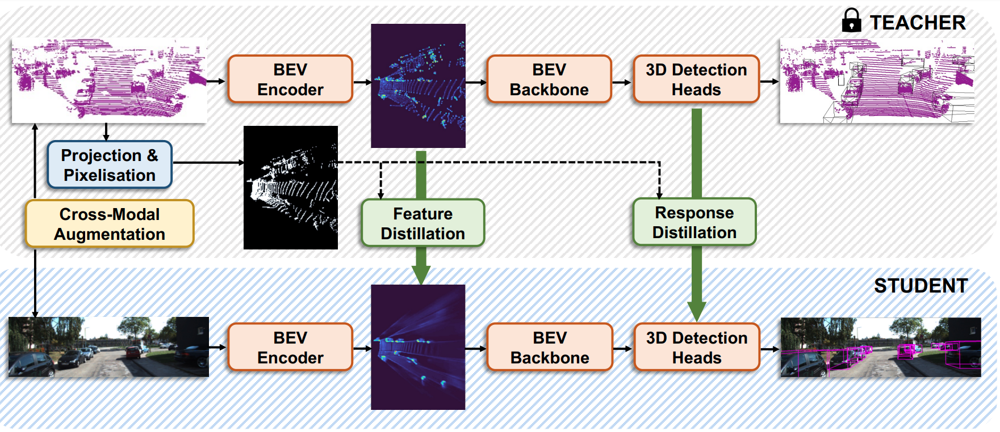

# [WACV'24] ODM3D: Alleviating Foreground Sparsity for Semi-Supervised Monocular 3D Object Detection

## Introduction
This repository contains a PyTorch implementation of [ODM3D](https://arxiv.org/abs/2310.18620) based on the [OpenPCDet](https://github.com/open-mmlab/OpenPCDet) codebase.
ODM3D is a LiDAR-to-RGB cross-modal knowledge distillation framework. It exploits unlabelled data and LiDAR point clouds to boost a monocular 3D object detector, leading to new state-of-the-art monocular detection performance on the KITTI dataset.
<p align="center">
    
</p>

## KITTI Validation Results
|        Methods         | 3D Car Easy@R40 | 3D Car Mod@R40 | 3D Car Hard@R40 | BEV Car Easy@R40 | BEV Car Mod@R40 | BEV Car Hard@R40 |
|:----------------------:|:---------------:|:--------------:|:---------------:|:----------------:|:---------------:|:----------------:|
|     CMKD (ECCV'22)     |      30.20      |     21.50      |      19.40      |        -         |        -        |        -         |
| Mix-Teaching (CSVT'23) |      29.74      |     22.27      |      19.04      |      37.45       |      28.99      |      25.31       |
|     LPCG (ECCV'22)     |      31.15      |     23.42      |    **20.60**    |        -         |        -        |        -         |
|    ODM3D (WACV'24)     |    **35.09**    |   **23.84**    |      20.57      |    **41.24**     |    **30.53**    |    **25.70**     |

## Checkpoints
We provide the pre-trained models for reproducing our experimental results. Currently, the provided model has better performance on the Car category and higher training efficiency than the one reported in our paper.

|   Method   | 3D Car Easy@R40 | 3D Car Mod@R40 | 3D Car Hard@R40 | BEV Car Easy@R40 | BEV Car Mod@R40 | BEV Car Hard@R40 |    Student     |                                            Teacher                                             |
|:----------:|:---------------:|:--------------:|:---------------:|:----------------:|:---------------:|:----------------:|:--------------:|:----------------------------------------------------------------------------------------------:|
| ODM3D-R50  |      35.32      |     23.96      |      21.16      |      43.37       |      30.82      |      27.07       |   [model](https://drive.google.com/file/d/1KjPb6Q5S5aPuqKy0tfX0DfhJx5AW00_G/view?usp=sharing)    | [model](https://drive.google.com/file/d/1NYlaQnS79dAsYSW85JR7NiHu2owc7-rc/view?usp=drive_link) |


## Installation
You may follow the guide provided in [CMKD](https://github.com/Cc-Hy/CMKD/blob/main/docs/INSTALL.md).

## Getting Started

### Organisation
You may follow the guide provided in [CMKD](https://github.com/Cc-Hy/CMKD/blob/main/docs/GETTING_STARTED.md). 
Make sure you use [this](https://drive.google.com/file/d/1YxG2Yb1OhlscahsdWrwymY1yFcsOTaqN/view?usp=drive_link) file as the training data instead of the original one, since the former contains pseudo-labels for unlabelled scenes.
Image backbone weights (e.g., deeplabv3_resnet50_coco-cd0a2569.pth) shall be automatically downloaded into folder "checkpoints", if not already there, as the training begins.

### Training
* First conduct stage-1 training with:
```python
python train_odm3d.py --cfg_file cfgs/kitti_models/ODM3D/odm3d_s1.yaml --pretrained_lidar_model ../checkpoints/scd-teacher-kitti.pth
```
* Then conduct stage-2 training with:
```python
python train_odm3d.py --cfg_file cfgs/kitti_models/ODM3D/odm3d_s2.yaml --pretrained_lidar_model ../checkpoints/scd-teacher-kitti.pth --pretrained_img_model ${PATH_TO_STAGE1_MODEL}
```
* To resume training from a previously saved checkpoint, do:
```python
python train_odm3d.py --cfg_file cfgs/kitti_models/ODM3D/odm3d_s1.yaml --pretrained_lidar_model ../checkpoints/scd-teacher-kitti.pth -ckpt ${PATH_TO_CKPT}
python train_odm3d.py --cfg_file cfgs/kitti_models/ODM3D/odm3d_s2.yaml --pretrained_lidar_model ../checkpoints/scd-teacher-kitti.pth --ckpt ${PATH_TO_CKPT}
```

### Evaluation
* Evaluate a pretrained model with: 
```python
python test_odm3d.py --cfg_file cfgs/kitti_models/ODM3D/odm3d_s2.yaml --ckpt ${PATH_TO_MODEL}
```


## Citation
If you find our paper helpful to your work, you may cite it as:
```
@inproceedings{odm3d,
author = {Weijia Zhang and Dongnan Liu and Chao Ma and Weidong Cai},
title = {Alleviating Foreground Sparsity for Semi-Supervised Monocular 3D Object Detection},
booktitle = {WACV},
year = {2024}
}
```
